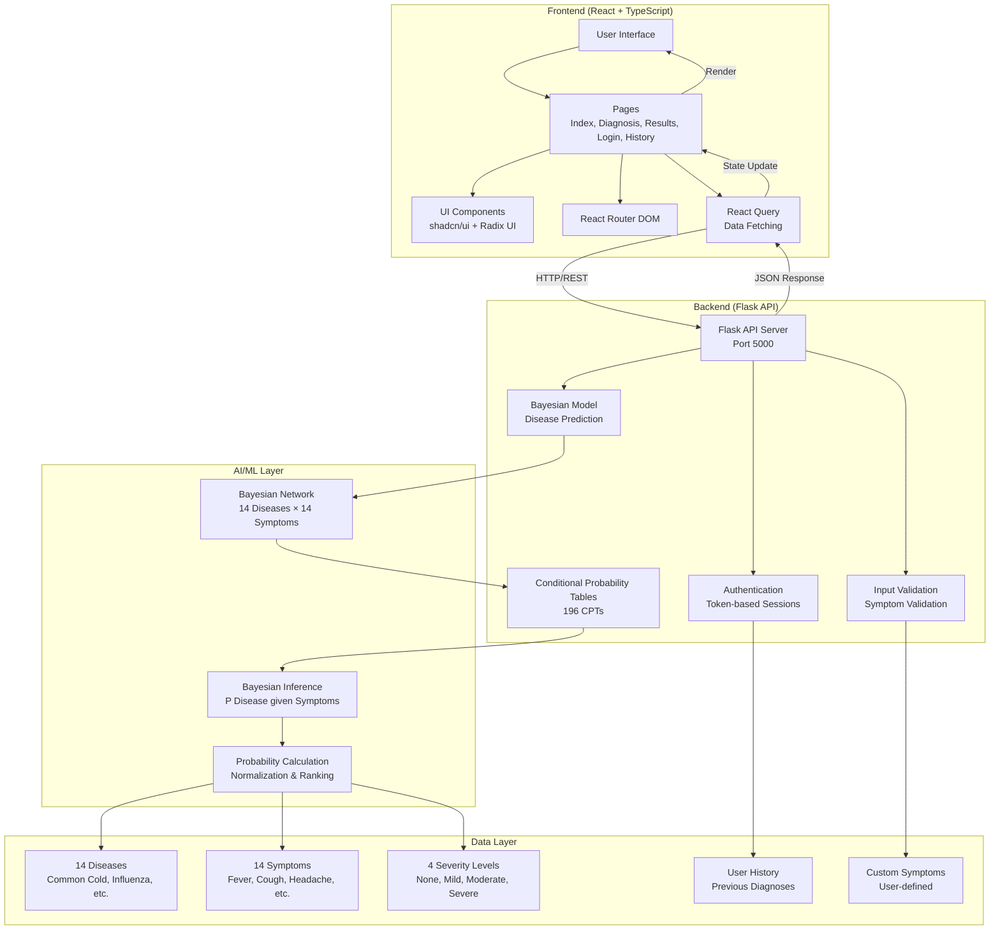
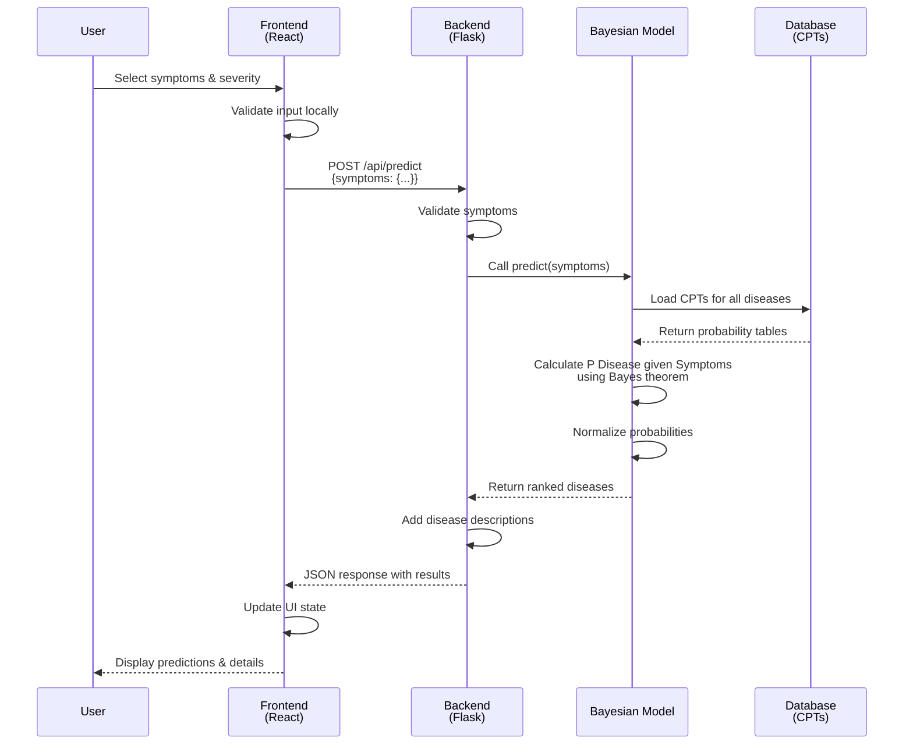
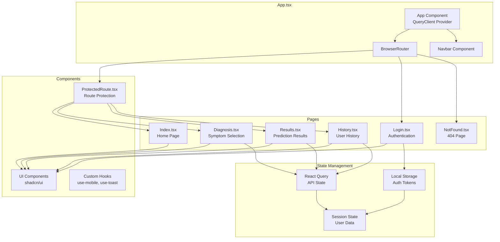

# AI-Based Disease Prediction System

A comprehensive web application that uses Bayesian inference to predict diseases based on symptom analysis. The system combines a React frontend with a Flask backend API to provide accurate disease predictions using medical knowledge and conditional probability tables.

## 🏥 Features

- **AI-Powered Analysis**: Advanced Bayesian reasoning algorithms analyze symptoms with medical precision
- **14 Diseases**: Common Cold, Influenza, Malaria, Dengue, Typhoid, Pneumonia, COVID-19, Asthma, Tuberculosis, Diabetes, Gastroenteritis, Migraine, Anemia, Allergic Rhinitis
- **14 Symptoms**: Comprehensive symptom set including Fever, Cough, Headache, Fatigue, Body Pain, Sore Throat, Runny Nose, Difficulty Breathing, Chills, Loss of Taste/Smell, Nausea, Chest Pain, Dizziness, Confusion
- **Severity Levels**: None, Mild, Moderate, Severe for each symptom
- **Real-time Predictions**: Instant analysis and predictions using Bayesian networks
- **Professional UI**: Medical-themed design with modern, responsive interface
- **Detailed Results**: Disease probabilities, descriptions, common causes, and severity assessments
- **User Authentication**: Login/register system with session management
- **Custom Symptoms**: Users can add their own symptoms with validation
- **History Tracking**: Save and view previous diagnoses
- **Comprehensive Testing**: Built-in test cases for all diseases

## 🏗️ System Architecture



## 🛠️ Technology Stack

### Frontend
- **React 18** with TypeScript
- **Vite** for fast development and building
- **shadcn/ui** components with Radix UI primitives
- **Tailwind CSS** for styling
- **React Router DOM** for navigation
- **React Query** for data fetching

### Backend
- **Flask** Python web framework
- **Bayesian Network** for disease prediction
- **Conditional Probability Tables** (196 CPTs)
- **CORS** support for frontend integration
- **RESTful API** design
- **Session Management** with token-based authentication
- **Input Validation** for symptoms and user data

## 🚀 Quick Start

### Prerequisites
- Node.js (v16 or higher)
- Python (v3.8 or higher)
- npm or yarn

### Installation

1. **Clone the repository**
```bash
git clone <YOUR_REPO_URL>
cd AI-based-Disease-Predcition-System-main/AI-based-Disease-Predcition-System-main
```

2. **Backend Setup (Flask)**
```powershell
cd backend
python -m venv .venv
\.venv\Scripts\Activate.ps1
pip install -r requirements.txt
python app.py
```
Backend will be available at `http://localhost:5000`.

3. **Frontend Setup (Vite React)**
```powershell
cd ..
echo VITE_BACKEND_URL=http://localhost:5000 > .env
npm install
npm run dev
```
Open the Local URL printed by Vite (for example `http://localhost:5173`).

## 📊 How It Works

### Data Flow Process



### Step-by-Step Process

1. **Symptom Selection**: Users select from 14 symptoms and rate their severity
2. **API Processing**: Frontend sends symptom data to Flask backend
3. **Bayesian Inference**: Backend uses conditional probability tables to calculate disease probabilities
4. **Results Display**: Frontend shows top predictions with detailed medical information

## 🔬 Bayesian Model

The system uses a Bayesian network with:
- **Prior Probabilities**: Equal probability for all diseases (1/14)
- **Conditional Probability Tables**: 196 CPTs (14 diseases × 14 symptoms)
- **Bayes Theorem**: P(Disease given Symptoms) ∝ P(Symptoms given Disease) × P(Disease)
- **Normalization**: Probabilities sum to 1

## 📡 API Endpoints

### Core Endpoints
- `GET /health` - Health check
- `GET /api/diseases` - List all diseases
- `GET /api/symptoms` - List all symptoms
- `GET /api/disease-info/<name>` - Get disease details
- `POST /api/predict` - Predict disease from symptoms
- `POST /api/batch-predict` - Batch predictions

### User Management
- `POST /api/login` - User authentication
- `POST /api/register` - User registration
- `GET /api/history` - Get user's diagnosis history
- `POST /api/history` - Add to history

### Custom Symptoms
- `GET /api/custom-symptoms` - Get user's custom symptoms
- `POST /api/custom-symptoms` - Add custom symptom
- `DELETE /api/custom-symptoms` - Remove custom symptom
- `POST /api/validate-symptom` - Validate custom symptom

## 🧪 Testing

### Backend API Testing
Test the backend API:
```bash
cd backend
python test_api.py
```

### Example Test Cases
The system includes comprehensive test cases for all diseases:

**Common Cold**: Runny Nose (Severe), Sore Throat (Moderate), Cough (Mild)
```bash
curl -X POST http://localhost:5000/api/predict \
  -H "Content-Type: application/json" \
  -d '{"symptoms": {"Runny Nose": "Severe", "Sore Throat": "Moderate", "Cough": "Mild"}}'
```

**Influenza**: Fever (Severe), Body Pain (Severe), Fatigue (Moderate)
```bash
curl -X POST http://localhost:5000/api/predict \
  -H "Content-Type: application/json" \
  -d '{"symptoms": {"Fever": "Severe", "Body Pain": "Severe", "Fatigue": "Moderate"}}'
```

**COVID-19**: Loss of Taste/Smell (Severe), Fever (Moderate), Cough (Moderate)
```bash
curl -X POST http://localhost:5000/api/predict \
  -H "Content-Type: application/json" \
  -d '{"symptoms": {"Loss of Taste/Smell": "Severe", "Fever": "Moderate", "Cough": "Moderate"}}'
```

### Comprehensive Testing Guide
For detailed testing scenarios and all disease test cases, refer to `DISEASE_TESTING_GUIDE.txt` which includes:
- Complete test cases for all 14 diseases
- Expected probability distributions
- Demonstration scenarios
- Edge case testing
- Performance validation

## 📁 Project Structure

```
AI-based-Disease-Predcition-System-main/
├── backend/
│   ├── app.py                 # Flask API server with all endpoints
│   ├── bayesian_model.py      # Bayesian inference model with CPTs
│   ├── test_api.py           # API test script
│   ├── requirements.txt      # Python dependencies
│   └── README.md            # Backend documentation
├── src/
│   ├── pages/
│   │   ├── Index.tsx         # Home page with features overview
│   │   ├── Diagnosis.tsx     # Symptom selection and custom symptoms
│   │   ├── Results.tsx       # Prediction results display
│   │   ├── Login.tsx         # User authentication
│   │   ├── History.tsx      # User's diagnosis history
│   │   └── NotFound.tsx      # 404 error page
│   ├── components/
│   │   ├── ui/               # shadcn/ui components
│   │   └── ProtectedRoute.tsx # Route protection component
│   ├── hooks/                # Custom React hooks
│   ├── lib/                  # Utility functions
│   └── assets/               # Images and static assets
├── public/                   # Static files
├── DISEASE_TESTING_GUIDE.txt # Comprehensive testing guide
├── SETUP.md                  # Detailed setup guide
├── package.json              # Frontend dependencies
├── tailwind.config.ts        # Tailwind CSS configuration
├── vite.config.ts           # Vite configuration
└── README.md                # This file
```

## 🔒 Security & Privacy

- **CORS Configuration**: Properly configured for frontend-backend communication
- **Session Management**: Token-based authentication with secure session handling
- **Input Validation**: Comprehensive validation for symptoms and user inputs
- **Data Privacy**: No permanent storage of sensitive health data
- **Custom Symptom Validation**: Advanced validation to prevent invalid or malicious inputs

## 🎯 User Interface Flow

### Frontend Component Architecture



### User Journey Flow

1. **Home Page** (`/`): Landing page with features overview and "Start Diagnosis" button
2. **Login Page** (`/login`): User authentication (optional but recommended for history)
3. **Diagnosis Page** (`/diagnosis`): Symptom selection with severity levels and custom symptom addition
4. **Results Page** (`/results`): AI prediction results with detailed disease information
5. **History Page** (`/history`): View previous diagnoses (requires login)

## 🚀 Deployment

### Development
- Backend runs on `http://localhost:5000`
- Frontend runs on `http://localhost:5173` (Vite default)

### Production Considerations
- Use Gunicorn for Flask backend in production
- Build frontend with `npm run build` for static hosting
- Configure proper CORS settings for production domain
- Set up environment variables for API URLs

## 📊 Performance

- **Real-time Predictions**: Instant analysis using optimized Bayesian calculations
- **Responsive Design**: Works seamlessly on desktop, tablet, and mobile devices
- **Efficient API**: RESTful endpoints with proper error handling
- **Optimized Frontend**: React Query for efficient data fetching and caching

## ⚠️ Medical Disclaimer

This system is for educational and demonstration purposes only. It should not be used as a substitute for professional medical advice, diagnosis, or treatment. Always consult with qualified healthcare professionals for medical concerns.

**Important Notes:**
- The Bayesian model uses simplified conditional probability tables
- Real-world medical diagnosis requires extensive clinical validation
- This is a demonstration of AI/ML concepts in healthcare
- Always seek professional medical advice for health concerns

## 🔧 Troubleshooting

### Common Issues

**Backend Issues:**
- Ensure Python dependencies are installed: `pip install -r requirements.txt`
- Check if port 5000 is available
- Verify Flask server is running: `python app.py`
- Check for Python version compatibility (3.8+)

**Frontend Issues:**
- Ensure Node.js dependencies are installed: `npm install`
- Check if port 5173 is available
- Verify backend API is accessible at `http://localhost:5000`
- Check browser console for JavaScript errors

**CORS Issues:**
- Backend has CORS enabled for localhost:5173
- If using different ports, update CORS settings in `backend/app.py`
- Ensure environment variable `VITE_BACKEND_URL` is set correctly

**API Connection Issues:**
- Test backend health: `curl http://localhost:5000/health`
- Check network connectivity
- Verify firewall settings
- Ensure both frontend and backend are running

## 🤝 Contributing

1. Fork the repository
2. Create a feature branch: `git checkout -b feature-name`
3. Make your changes
4. Test thoroughly using `python test_api.py`
5. Commit your changes: `git commit -m "Add feature"`
6. Push to the branch: `git push origin feature-name`
7. Submit a pull request

### Development Guidelines
- Follow existing code style and patterns
- Add tests for new features
- Update documentation as needed
- Ensure all tests pass before submitting
- Test both frontend and backend changes

## 📄 License

This project is open source and available under the [MIT License](LICENSE).
